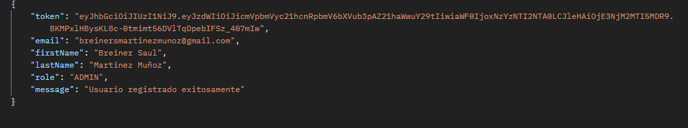
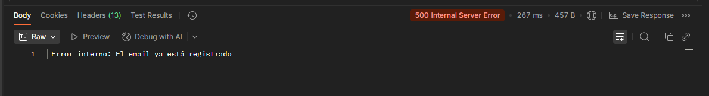
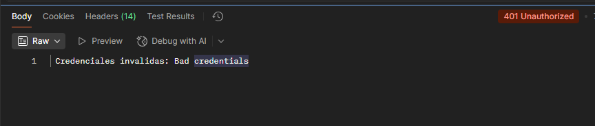
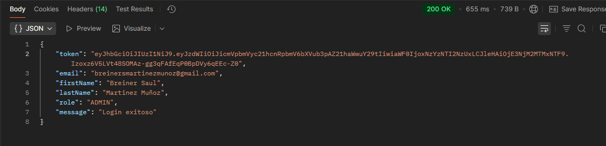

# implementacion del GlobalExceptionHandler en la aplicación:

## Beneficios de esta implementación:

- Codigo más limpio sin try-catch repetidos
- Manejo centralizado de errores
- Respuestas HTTP consistentes
- Facil de mantener y extender

## AuthService y UserService - En lugar de RuntimeException, lanzas excepciones específicas:

- UsernameNotFoundException: Capturada y retorna 404
- BadCredentialsException: Capturada automáticamente por Spring Security y retorna 401
- DataIntegrityViolationException: Capturada y retorna 400 (email duplicado)

## AuthService
```
public AuthResponse login(LoginRequest request) {
// BadCredentialsException será lanzada automáticamente por authenticationManager

        // Autenticar
        authenticationManager.authenticate(
                new UsernamePasswordAuthenticationToken(
                        request.getEmail(),
                        request.getPassword()
                )
        );

        // Si llega aquí, la autenticación fue exitosa
        User user = userRepository.findByEmail(request.getEmail())
                //Excepcion usada de GlobalExceptionHandler
                .orElseThrow(() -> new UsernameNotFoundException("Usuario no encontrado"));

```


## UserService
- En lugar de RuntimeException, lanzas excepciones específicas:

```
public class UserService {

    private final UserRepository userRepository;
    private final PasswordEncoder passwordEncoder;

    public UserService(UserRepository userRepository, PasswordEncoder passwordEncoder) {
        this.userRepository = userRepository;
        this.passwordEncoder = passwordEncoder;
    }

    // Obtener todos los usuarios
    public List<UserResponse> getAllUsers() {
        return userRepository.findAll().stream()
                .map(this::convertToResponse)
                .collect(Collectors.toList());
    }

    // Obtener usuario por ID
    public UserResponse getUserById(UUID id) {
        User user = userRepository.findById(id)
                //Reemplazo de RuntimeException con excepciones específicas
                .orElseThrow(() -> new UsernameNotFoundException("Usuario no encontrado con ID: " + id));
        return convertToResponse(user);
    }

    // Obtener usuario por email
    public UserResponse getUserByEmail(String email) {
        User user = userRepository.findByEmail(email)
                .orElseThrow(() -> new UsernameNotFoundException("Usuario no encontrado con email: " + email));
        return convertToResponse(user);
    }

    // Actualizar usuario
    @Transactional
    public UserResponse updateUser(UUID id, UpdateUserRequest request) {
        User user = userRepository.findById(id)
                .orElseThrow(() -> new UsernameNotFoundException("Usuario no encontrado con ID: " + id));

  

        if (request.getEmail() != null && !request.getEmail().isEmpty()) {
            // Verificar que el email no esté en uso por otro usuario
            userRepository.findByEmail(request.getEmail())
                    .ifPresent(existingUser -> {
                        if (!existingUser.getEmail().equals(id)) {
                            //Reemplazo de RuntimeException con excepcion específica
                            throw new DataIntegrityViolationException("El email ya está en uso");
                        }
                    });
            user.setEmail(request.getEmail());
        }

       
        User updatedUser = userRepository.save(user);
        return convertToResponse(updatedUser);
    }

    // Eliminar usuario (eliminación física)
    @Transactional
    public void deleteUser(UUID id) {
        User user = userRepository.findById(id)
                .orElseThrow(() -> new UsernameNotFoundException("Usuario no encontrado con ID: " + id));
        userRepository.delete(user);
    }

    // Desactivar usuario (eliminación lógica - recomendado)
    @Transactional
    public UserResponse deactivateUser(UUID id) {
        User user = userRepository.findById(id)
                .orElseThrow(() -> new UsernameNotFoundException("Usuario no encontrado con ID: " + id));
        user.setActive(false);
        User updatedUser = userRepository.save(user);
        return convertToResponse(updatedUser);
    }

    // Activar usuario
    @Transactional
    public UserResponse activateUser(UUID id) {
        User user = userRepository.findById(id)
                .orElseThrow(() -> new UsernameNotFoundException("Usuario no encontrado con ID: " + id));
        user.setActive(true);
        User updatedUser = userRepository.save(user);
        return convertToResponse(updatedUser);
    }


}

```


## AUTHCONTROLLER - Simplificado con GlobalExceptionHandler

- AuthController y UserController - Se eliminan los try-catch genericos. 
- Las excepciones se lanzan naturalmente y el handler las captura.

```
public class AuthController {

    private final AuthService authService;

    public AuthController(AuthService authService) {
        this.authService = authService;
    }


    //  Las excepciones se lanzan naturalmente y el handler las captura.

    @PostMapping("/register")
    public ResponseEntity<AuthResponse> register(@RequestBody RegisterRequest request) {
        // Las excepciones serán capturadas automáticamente por GlobalExceptionHandler
        AuthResponse response = authService.register(request);
        return ResponseEntity.ok(response);

        /*
        //try-catch generico:
        try {

            AuthResponse response = authService.register(request);
            return ResponseEntity.ok(response);
        } catch (RuntimeException e) {
            return ResponseEntity.badRequest()
                    .body(AuthResponse.builder()
                            .message(e.getMessage())
                            .build());
        }
         */
    }

    @PostMapping("/login")
    public ResponseEntity<AuthResponse> login(@RequestBody LoginRequest request) {
        // BadCredentialsException será capturada por GlobalExceptionHandler
        AuthResponse response = authService.login(request);
        return ResponseEntity.ok(response);

       /*
        //try-catch generico:
        try {
            AuthResponse response = authService.login(request);
            return ResponseEntity.ok(response);
        } catch (RuntimeException e) {
            return ResponseEntity.badRequest()
                    .body(AuthResponse.builder()
                            .message("Credenciales inválidas")
                            .build());
        }

        */
    }


}
```
## EJEMPLO  DE FUNCIONAMIENTO:

- Registro de usuario:

- Intento de registrar usuario existente: 

- Credenciales invalidas: 

- Login exitoso:


# 

## USERCONTROLLER - Simplificado con GlobalExceptionHandler
```


    // Obtener todos los usuarios (solo admin)
    @GetMapping
    @PreAuthorize("hasRole('ADMIN')")
    public ResponseEntity<List<UserResponse>> getAllUsers() {
        List<UserResponse> users = userService.getAllUsers();
        return ResponseEntity.ok(users);
        /*
        try {
            List<UserResponse> users = userService.getAllUsers();
            return ResponseEntity.ok(users);
        } catch (Exception e) {
            return ResponseEntity.internalServerError().build();
        }

         */
    }

    // Obtener usuario por ID (admin o el mismo usuario)
    //     Tanto los usuarios como los administradores pueden realizar peticiones
//     Los usuarios y administradores deben utilizar su respectivo tockend para poder realizar las peticiones

    @GetMapping("/{id}")
    public ResponseEntity<UserResponse> getUserById(@PathVariable UUID id) {
        UserResponse user = userService.getUserById(id);
        return ResponseEntity.ok(user);

        /*try {
            UserResponse user = userService.getUserById(id);
            return ResponseEntity.ok(user);
        } catch (RuntimeException e) {
            return ResponseEntity.notFound().build();
        }

         */
    }

    // Obtener perfil del usuario autenticado
    @GetMapping("/me")
    public ResponseEntity<UserResponse> getCurrentUser(Authentication authentication) {
        String email = authentication.getName();
        UserResponse user = userService.getUserByEmail(email);
        return ResponseEntity.ok(user);

        /*
        try {
            String email = authentication.getName();
            UserResponse user = userService.getUserByEmail(email);
            return ResponseEntity.ok(user);
        } catch (RuntimeException e) {
            return ResponseEntity.notFound().build();
        }

         */
    }

    // Obtener usuarios activos (solo admin)
    @GetMapping("/active")
    @PreAuthorize("hasRole('ADMIN')")
    public ResponseEntity<List<UserResponse>> getActiveUsers() {
        List<UserResponse> users = userService.getActiveUsers();
        return ResponseEntity.ok(users);
        /*
        try {
            List<UserResponse> users = userService.getActiveUsers();
            return ResponseEntity.ok(users);
        } catch (Exception e) {
            return ResponseEntity.internalServerError().build();
        }

         */
    }

    // Obtener usuarios por rol (solo admin)
    @GetMapping("/role/{role}")
    @PreAuthorize("hasRole('ADMIN')")
    public ResponseEntity<List<UserResponse>> getUsersByRole(@PathVariable Role role) {
        List<UserResponse> users = userService.getUsersByRole(role);
        return ResponseEntity.ok(users);
        /*
        try {
            List<UserResponse> users = userService.getUsersByRole(role);
            return ResponseEntity.ok(users);
        } catch (Exception e) {
            return ResponseEntity.internalServerError().build();
        }
         */
    }

    // Actualizar usuario (admin o el mismo usuario)
    @PutMapping("/{id}")
    @PreAuthorize("hasRole('ADMIN') or #id == authentication.principal.id")
    public ResponseEntity<UserResponse> updateUser(
            @PathVariable UUID id,
            @RequestBody UpdateUserRequest request,
            Authentication authentication
    ) {
        if (!authentication.getAuthorities().stream()
                .anyMatch(a -> a.getAuthority().equals("ROLE_ADMIN"))) {
            request.setRole(null);
            request.setActive(null);
        }

        UserResponse updatedUser = userService.updateUser(id, request);
        return ResponseEntity.ok(updatedUser);
        /*
        try {
            // Si no es admin, no puede cambiar el rol ni el estado activo
            if (!authentication.getAuthorities().stream()
                    .anyMatch(a -> a.getAuthority().equals("ROLE_ADMIN"))) {
                request.setRole(null);
                request.setActive(null);
            }

            UserResponse updatedUser = userService.updateUser(id, request);
            return ResponseEntity.ok(updatedUser);
        } catch (RuntimeException e) {
            return ResponseEntity.badRequest().build();
        }
        */

    }

    // Eliminar usuario físicamente (solo admin)
    @DeleteMapping("/{id}")
    @PreAuthorize("hasRole('ADMIN')")
    public ResponseEntity<Void> deleteUser(@PathVariable UUID id) {
        userService.deleteUser(id);
        return ResponseEntity.noContent().build();
        /*
        try {
            userService.deleteUser(id);
            return ResponseEntity.noContent().build();
        } catch (RuntimeException e) {
            return ResponseEntity.notFound().build();
        }

         */
    }

    // Desactivar usuario (eliminación lógica - solo admin)
    @PatchMapping("/{id}/deactivate")
    @PreAuthorize("hasRole('ADMIN')")
    public ResponseEntity<UserResponse> deactivateUser(@PathVariable UUID id) {
        UserResponse user = userService.deactivateUser(id);
        return ResponseEntity.ok(user);
        /*
        try {
            UserResponse user = userService.deactivateUser(id);
            return ResponseEntity.ok(user);
        } catch (RuntimeException e) {
            return ResponseEntity.notFound().build();
        }
         */
    }

    // Activar usuario (solo admin)
    @PatchMapping("/{id}/activate")
    @PreAuthorize("hasRole('ADMIN')")
    public ResponseEntity<UserResponse> activateUser(@PathVariable UUID id) {
        UserResponse user = userService.activateUser(id);
        return ResponseEntity.ok(user);
        /*
        try {
            UserResponse user = userService.activateUser(id);
            return ResponseEntity.ok(user);
        } catch (RuntimeException e) {
            return ResponseEntity.notFound().build();
        }

         */
    }
}

```